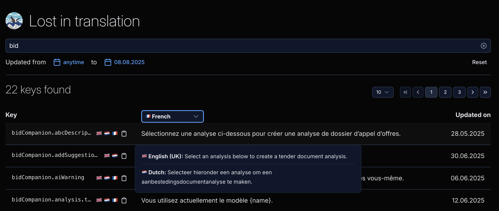

# Hello there!

### Requirements

- I can see a list of all translation keys
  - I can see the key, translation value and the last updated date
  - When hovering over a row, I see a tooltip with the full translation value for each locale.
- I can filter on keys using a search input
- I can filter on translation keys using a date range
- I can see on which page I am and how many pages there are
  - I am able to change the page
  - I am able to change the page size
- When no keys are found, I see a empty state



## Solution

- This is a Nuxt 3 application
- State Management: Pinia
- Nuxt UI for components with Tailwind CSS for styling

## Running the app

```bash
npm ci
npm run dev
```

### Folder structure

_Mostly_ standard Nuxt layout with:

- `pages` for routing
- `ui` for Vue components
- `stores` for Pinia stores
- `server/api` for API routes
- `lib` for shared logic
- `lib/directus` for Directus API types, fetching

## Not implemented / Future improvements / Nice to have

### Testing

- Add `Vitest` for unit testing components and stores
- Implement component testing with `@testing-library/vue`
- Add E2E tests with `Playwright` or `Cypress`
- Set up test coverage reporting
- Add API mocking for tests

### CSS

Move inline Tailwind classes to `<style>` blocks with `@apply`.
Create reusable CSS utility classes

```html
<template>
  <div class="my-component" />
</template>

<style lang="postcss" scoped>
  .my-component {
    @apply flex items-center p-4 bg-white rounded-lg shadow-md;
  }
</style>
```

### Other Non Functional Requirements

- DX tooling: `Eslint`, `Prettier`, or `Biome` monorepo tools like `nx` or `turborepo`
- `.env` file support for secrets
- CI/CD
- Proper logging system
- Add performance monitoring, and error tracking
- Feature flagging and A/B testing
